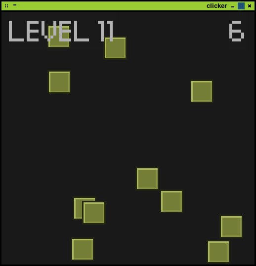

# clicker

### Written in 2 hours (ish) for [Ludum Dare] 27 (10 Seconds)

clicker consists of clicking... with the mouse. You have 10 seconds to click all the buttons and advance to the next level. Each progressive level adds an extra button and every %5 level has a little shake! 

Requires Java or Open JDK 1.6+ to play

### Dependencies (Not included)

* [LWJGL2]
* [slick-util]
* [JOrbis]
* [progaurd] *(optional)*

Please amend the post scripts as needed.

### Download

All the needful can be found at [clicker.flob.io]

### Screenshot

---

## License

Copyright (c) 2013 Robert Calvert ([robert.calvert.io])

See the license file for license rights and limitations (GPLv2).

[Ludum Dare]:http://ludumdare.calvert.io
[clicker.flob.io]:http://clicker.flob.io

[LWJGL2]:http://www.lwjgl.org
[slick-util]:http://slick.ninjacave.com
[JOrbis]:http://www.jcraft.com/jorbis
[progaurd]:http://proguard.sourceforge.net
[robert.calvert.io]:http://robert.calvert.io

